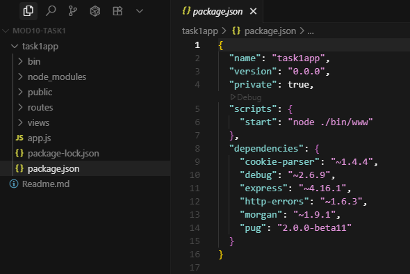
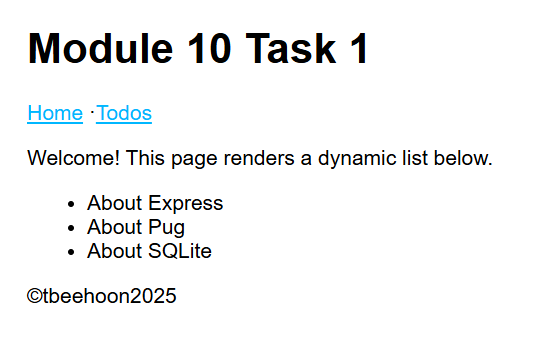
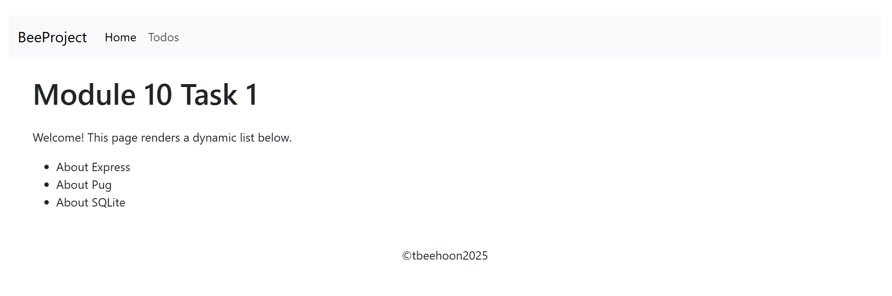
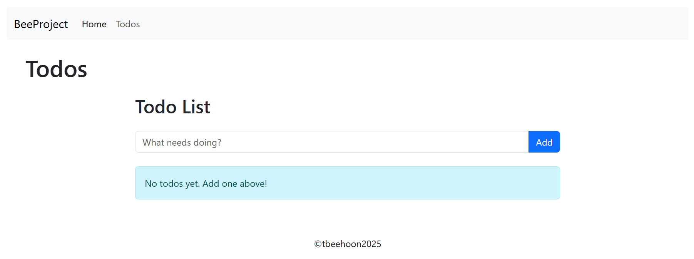
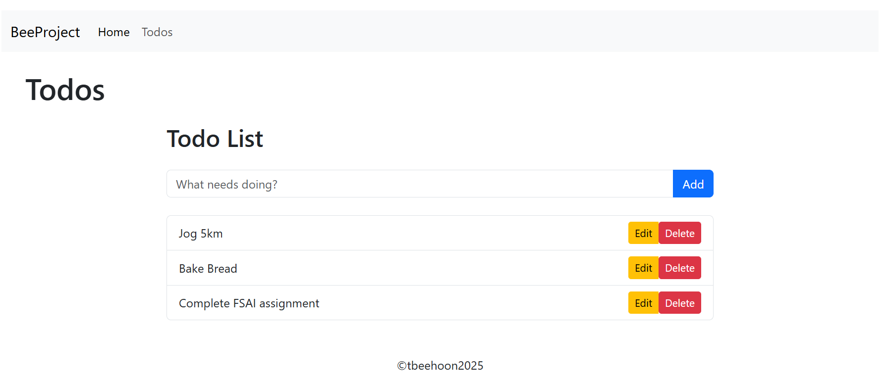
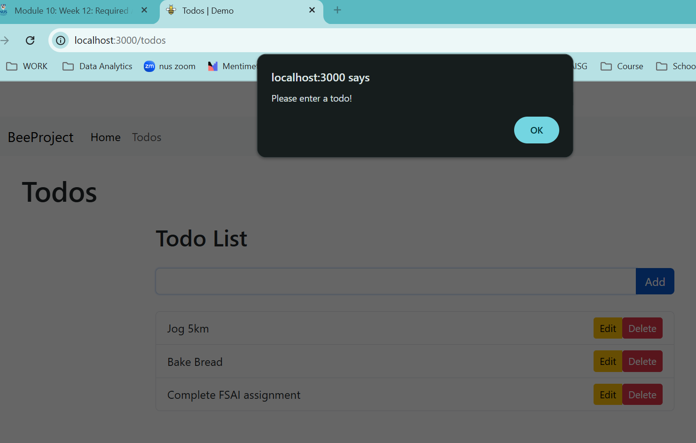
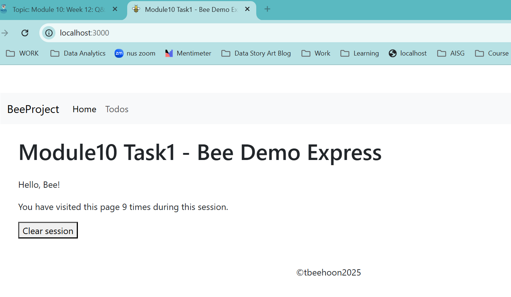

# Express+Pug+SQLite

Compiled  by Tan Bee Hoon (contact: tbeehoon@gmail), dated 29 Sep 2025

This readme shows: 

1. Tasks Intro

2. Environment setup for Express

3. Pug Setup

4. Integration using SQLite and CRUD operation

5. Serve Static Assets

6. Manage Session State

   


## 1. Tasks Intro 

The assignment tasks to be included in this projects include:

**1. Express.js with Pug Template Engine ** 

a) Set up an Express.js web application with Pug template engine. 

b) Implement dynamic content rendering using Pug 

c) Database integration using SQLite in Express.js 


**3. Static Assets and Session Management ** 

a) Serve static assets in Express.js

b) Manage session state using Express.js sessions


**4. Database interaction and CRUD operations ** 

b) Set up CRUD operations in Express.js using SQLite. 


## 2. Environment Setup

### 2.1 Install NVM (Node Version Manager) (*Optional*)

If NVM is not installed yet, download the latest `nvm-setup.exe` from the releases page: https://github.com/coreybutler/nvm-windows/releases

> [!TIP]
>
> Avoid installing the “global” Node.js from nodejs.org if using NVM. 


### 2.2 Install the latest version (*Optional*) 

If the latest version is not available in on the machine, install the version required (LTS recommended):

```
# Install latest LTS
nvm install lts

# Use it now
nvm use lts
```

Do verification:

```
# Verify
node -v
npm -v
```

Note: This installation using node version v22.19.0


### 2.3 Create the project

Generate the project:

```
npx express-generator --view=pug task1ap
```

> [!TIP]
>
> **Recommended way** if you haven’t installed `express-generator` globally.
>
> `npx` will fetch the latest `express-generator` package from npm and run it directly.
>
> No need to keep it installed on your system afterward.
>
> In summary: no install needed, always latest

Change to project directory:

```
cd task1app
```

Then install dependencies:

```
npm install
```

This is the directory structure and dependency installed: 




### 2.4 Setup for auto-reload

For convenience, add auto-reload to the setup.

Add **nodemon** for auto-reload:

```
npm i -D nodemon
npm install --save-dev nodemon
```

In `package.json`, add a dev script:

```
"scripts": {
  "start": "node ./bin/www",
  "dev": "nodemon ./bin/www"
}
```


### 2.5 Provide a default port number (*Optional*)

This line of code should be included as part of the setup. Update the file "`bin/www`"

```
var port = normalizePort(process.env.PORT || '3000');
app.set('port', port);
```

#### a. **Checks for an environment variable**

- `process.env.PORT` looks for a `PORT` variable in your system environment.
- This is common in hosting platforms (like Heroku, Render, Azure, etc.) where the platform assigns your app a port dynamically.
- If `process.env.PORT` is **not set**, it falls back to `'3000'`.

#### b. **Provides a default (fallback)**

- The `|| '3000'` means:
  - If no environment variable exists, use string `'3000'`.
  - So when you run locally, you usually get port `3000` unless you override it.

#### c. **Normalizes the value**

- `normalizePort()` is a helper function (defined further down in `bin/www`). It makes sure the port is in a usable format:

  

### 2.6 Add Bootstrap to the project (*Optional*)

Install Bootstrap and its dependencies:

```
npm install bootstrap
```

Import Bootstrap CSS in your main JS file (e.g., index.js, App.js, or main.js):

```
import 'bootstrap/dist/css/bootstrap.min.css';
```


### 2.7 Initialize Git

Version control the project using Git.

```
# Initialize a git repository
git init

# Add all project files
git add .

# Commit the files
git commit -m "Initial commit: setup project"
```

To add to Github.

```
# Add remote 
git remote add origin https://github.com/tbeehoon/module10Express.git

# Push changes
git branch -M main
git push -u origin main
```

> [!TIP]
>
> In case identity need to be authenticated:

```
git config --global user.email "you@example.com"
git config --global user.name "Your Name"
```

> [!TIP]
>
> In case you have accidentally create a remote origin and need to replace it:
>
> ```
> git remote set-url origin https://github.com/tbeehoon/module10Express.git
> ```
>
> To check:
>
> ```
> git remote -v
> ```


### 2.8 Setup .gitignore

Add a `.gitignore` file in the root of the project to exclude files and folders not required in version control. Some examples of items to include:

```
# dependencies
/node_modules

# production build
/dist

# logs
npm-debug.log*
*.log

# environment variables
.env
.env.local
.env.*.local

# IDE/editor folders
.vscode/
.DS_Store
Thumbs.db
```


## 3. Pug Setup 

The following setup Dynamic content rendering with Pug

### 3.1 Edit a route (send dynamic data)

Edit the routing in routes/index.js.

```
var express = require('express');
var router = express.Router();

router.get('/', function(req, res) {
  const items = [
    { id: 1, text: 'About Express' },
    { id: 2, text: 'About Pug' },
    { id: 3, text: 'About SQLite' }
  ];
  res.render('index', { title: 'Module 10 Task 1', items, showHelp: true });
});

module.exports = router;
```


### 3.2 Edit Layout & template

Edit the layout in **views/layout.pug**.

```
doctype html
html
  head
    title #{title} | Demo
    meta(charset="utf-8")
    meta(name="viewport", content="width=device-width, initial-scale=1")
    link(rel="stylesheet", href="/stylesheets/style.css")
  body
    header
      h1 #{title}
      nav
        a(href="/") Home
        |  ·
        a(href="/todos") Todos
    main
      block content
    footer
      p ©tbeehoon#{new Date().getFullYear()}

```

Edit the main html index page, **views/index.pug**.

```
extends layout

block content
  if showHelp
    p Welcome! This page renders a dynamic list below.

  if items && items.length
    ul
      each item in items
        li #{item.text}
  else
    p No items found.
```

Run the page:

```
npm run dev
```

This is the output:



### 3.4 to Update with bootstrap styling

Copy bootstrap files to public folder:

```
copy node_modules\bootstrap\dist\css\bootstrap.min.css task1app\public\stylesheets\

copy node_modules\bootstrap\dist\js\bootstrap.bundle.min.js task1app\public\javascripts\
```

Edit the layout file layout.pug with the the following:

```
doctype html
html
  head
    title #{title} | Demo
    meta(charset="utf-8")
    meta(name="viewport", content="width=device-width, initial-scale=1")
    link(rel="stylesheet", href="/stylesheets/style.css")
    link(rel="stylesheet", href="/stylesheets/bootstrap.min.css")
  body
    nav.navbar.navbar-expand-lg.navbar-light.bg-light.mb-4
      .container-fluid
        a.navbar-brand(href="/") BeeProject
        button.navbar-toggler(type="button", data-bs-toggle="collapse", data-bs-target="#navbarNav", aria-controls="navbarNav", aria-expanded="false", aria-label="Toggle navigation")
          span.navbar-toggler-icon
        #navbarNav.collapse.navbar-collapse
          ul.navbar-nav.me-auto.mb-2.mb-lg-0
            li.nav-item
              a.nav-link.active(href="/") Home
            li.nav-item
              a.nav-link(href="/todos") Todos
    .container
      header.my-4
        h1 #{title}
      main
        block content
      footer.text-center.mt-5
        p ©tbeehoon#{new Date().getFullYear()}
    script(src="/javascripts/bootstrap.bundle.min.js")
```

Here’s a summary of the changes made to the layout.pug:

- Added Bootstrap CSS and JS:

  - Linked bootstrap.min.css in the <head>.

  - Included bootstrap.bundle.min.js at the bottom of the body.

- Upgraded the navigation bar:

  - Replaced the old nav with a responsive Bootstrap navbar component.

  - Added a brand link (BeeProject) using .navbar-brand.

  - Kept both the brand and a Home link in the navigation.

  - Styled the navigation links (Home, Todos) with Bootstrap classes.

- Improved layout structure:

  - Wrapped the main content in a Bootstrap .container for better alignment and spacing.

  - Added spacing and centering to the header and footer using Bootstrap utility classes.

- Footer update:

  - Footer is now centered and spaced with .text-center and .mt-5.

  - Footer displays ©tbeehoon<year> with the year remaining dynamic.


This is the new bootstrap look: 



## 4. Integration using SQLite and CRUD operations (For Task 4b)

### 4.1 Install the driver for **better-sqlite3**:

```
npm i better-sqlite3
```


### 4.2 Create a DB module

To set up a SQLite-backed todo store with functions for listing, adding, and deleting todos, and have a router template for CRUD operations on those todos.

Create a new db/index.js.

```
const Database = require('better-sqlite3');
const db = new Database('app.db'); // file created if missing

// Create a table if it doesn't exist
db.exec(`
  CREATE TABLE IF NOT EXISTS todos (
    id INTEGER PRIMARY KEY AUTOINCREMENT,
    text TEXT NOT NULL,
    created_at DATETIME DEFAULT CURRENT_TIMESTAMP
  );
`);

module.exports = {
  allTodos() {
    return db.prepare('SELECT id, text, created_at FROM todos ORDER BY id DESC').all();
  },
  addTodo(text) {
    return db.prepare('INSERT INTO todos (text) VALUES (?)').run(text);
  },
  deleteTodo(id) {
    return db.prepare('DELETE FROM todos WHERE id = ?').run(id);
  },
  updateTodo(id, text) {
    return db.prepare('UPDATE todos SET text = ? WHERE id = ?').run(text, id);
  }
};

```


### 4.3 Add a router for CRUD

Create a **routes/todo.js**

```
const express = require('express');
const router = express.Router();
const store = require('../db');

// List
router.get('/', (req, res) => {
  const todos = store.allTodos();
  res.render('todos/index', { title: 'Todos', todos });
});

// Show edit form
router.get('/:id/edit', (req, res) => {
  const id = Number(req.params.id);
  const todo = store.allTodos().find(t => t.id === id);
  if (!todo) return res.redirect('/todos');
  res.render('todos/edit', { title: 'Edit Todo', todo });
});

// Update
router.post('/:id/edit', (req, res) => {
  const id = Number(req.params.id);
  const text = (req.body.text || '').trim();
  if (!Number.isNaN(id) && text) store.updateTodo(id, text);
  res.redirect('/todos');
});

// Create
router.post('/', (req, res) => {
  const text = (req.body.text || '').trim();
  if (text) store.addTodo(text);
  res.redirect('/todos');
});

// Delete
router.post('/:id/delete', (req, res) => {
  const id = Number(req.params.id);
  if (!Number.isNaN(id)) store.deleteTodo(id);
  res.redirect('/todos');
});

module.exports = router;
```


### 4.4 Wire Router and Body Parsers 

Mount the router in app.js:

```
var todosRouter = require('./routes/todos');
app.use('/todos', todosRouter);
```

That code imports the `todos` router and tells Express: *“For every request that starts with `/todos`, hand it off to the router defined in `routes/todos.js`.”*


### 4.5 Create pug views for the todo list with bootstrap styling

Make a folder `views/todos/` and add views/todos/index.pug.

Include the code:

```
extends ../layout

block content
  .row.justify-content-center
    .col-md-8
      h2.mb-4 Todo List
      if todo
        form(action=`/todos/${todo.id}/edit` method="POST" class="input-group mb-4")
          input.form-control(type="text" name="text" value=todo.text required)
          button.btn.btn-success(type="submit") Update
          a.btn.btn-secondary.ms-2(href="/todos") Cancel
      else
        form(action="/todos" method="post" class="input-group mb-4")
          input.form-control(type="text" name="text" placeholder="What needs doing?" required)
          button.btn.btn-primary(type="submit") Add
      if todos.length
        ul.list-group
          each t in todos
            li.list-group-item.d-flex.justify-content-between.align-items-center
              span= t.text
              .btn-group
                a.btn.btn-sm.btn-warning(href=`/todos/${t.id}/edit`) Edit
                form(action=`/todos/${t.id}/delete` method="post" class="d-inline m-0 p-0")
                  button.btn.btn-sm.btn-danger(type="submit" onclick="return confirm('Delete this todo?')") Delete
      else
        div.alert.alert-info No todos yet. Add one above!
```

The code does the following:

- The form uses an input group and styled button.

- Todos are displayed in a Bootstrap list group.

- The layout is responsive and visually appealing.

- Alerts and spacing use Bootstrap utility classes.


### 4.6 Output

This is how the **todos** page looks like:





### 4.7 Summary

The setup here supports all CRUD operations for todos using SQLite:

- Create: Add new todos.

- Read: List all todos.

- Update: Edit existing todos (with an edit form and update route).

- Delete: Remove todos.


## 5. Serve Static Assets

### 5.1 Add the path

To serve static assets, first add the path /public in app.js:

```
const path = require('path');
const express = require('express');
const app = express();

// ... other middleware above

// Serve everything in /public at the root path (e.g., /stylesheets/style.css)
app.use(express.static(path.join(__dirname, 'public'), {
  maxAge: '1d',          // cache static files for 1 day (tune as needed)
  etag: true,
  lastModified: true
}));

module.exports = app;
```


### 5.2 Add Public assets

Add in the assets items for image, javascript and css file:

```
public/
  images/
    bee-icon.png
  javascripts/
    main.js
  stylesheets/
    style.css      <-- generator already links this
```


### 5.3 edit the views 

Use in Pug templates views/layout.pug:

```
head
  link(rel="stylesheet", href="/stylesheets/style.css")
  script(src="/javascripts/main.js")
  link(rel="icon", href="/favicon.png", type="image/png")
```


### 5.4 Edit static JavaScript files

Client-side form validation is added. So if a user tries to submit an empty or whitespace-only todo, the form will not submit and an alert will appear.

Add a Client-side form validation feature in the javascripts/main.js:

```
document.addEventListener('DOMContentLoaded', function() {
  const form = document.querySelector('form[action="/todos"]');
  if (form) {
    form.addEventListener('submit', function(e) {
      const input = form.querySelector('input[name="text"]');
      if (input && !input.value.trim()) {
        e.preventDefault();
        alert('Please enter a todo!');
      }
    });
  }
});

```

> [!TIP]
>
> **What are static assets?**
>
> Static assets are files that are served to the client exactly as they are stored, without any server-side processing. So this Client-side form validation feature can be considered a client-side asset.


### 5.5 Output 

The favicon is added.

The form checking feature is added. 




## 6. Manage Session State

Add sessions and demo with (1) a **visit counter** and (2) a tiny **“set your name”** form that stores to session. Use **express-session** + **connect-sqlite3** so session data survives server restarts (stored in a SQLite file), instead of the default in-memory store.

### 6.1 Install the required package 

```
npm i express-session connect-sqlite3
npm install dotenv
```

> [!TIP]
>
> `express-session` adds session middleware (creates/reads the session cookie and `req.session`).
>
> `connect-sqlite3` is a session **store** that saves session rows in a SQLite database file so they persist.
>
> `connect-sqlite3` is a **ready-made store adapter** for `express-session`.


> [!TIP]
>
> The **existing SQLite code** (with `better-sqlite3` or `sqlite3`) is for **application data** (e.g., todos, users, posts), so not for this purpose.
>
> **Session storage** is a separate concern: Express-session needs a place to store session IDs, expiration times, and data blobs.


### 6.2 Create a place for the DB file 

```
mkdir -p var
```

**Purpose:**

- Keeps session DB files (e.g., `var/sessions.sqlite`) out of your source folders.

**Note:** 

* Add to .gitignore to prevents committing session files to Git.

```
var/
```


### 6.3 Configure the session middleware

Open `app.js` and add this:

```
const session = require('express-session');
const SQLiteStore = require('connect-sqlite3')(session);

// If you might deploy behind a proxy (Render/Heroku/Nginx), keep this:
app.set('trust proxy', 1);

app.use(session({
  store: new SQLiteStore({
    dir: './var',            // where to put the DB file
    db: 'sessions.sqlite',   // file name; auto-created if missing
    // ttl: 86400000,        // (optional) custom expiry in ms
  }),
  secret: process.env.SESSION_SECRET,
  resave: false,               // don’t rewrite unchanged sessions
  saveUninitialized: false,    // only create session when used
  cookie: {
    httpOnly: true,            // JS can’t read the cookie
    sameSite: 'lax',           // good default vs CSRF
    secure: false,             // set true when you serve over HTTPS
    maxAge: 1000 * 60 * 60 * 2 // 2 hours
  }
}));
```

**Purpose:**

- **`store`**: points sessions to SQLite instead of memory.

- **`secret`**: signs cookies; keep it strong and in an env var in real apps.

- **`resave`/`saveUninitialized`**: recommended flags to reduce unnecessary writes.

- **`cookie`**: controls security and lifetime.

- **`trust proxy`**: required when setting `secure:true` behind a proxy so cookies aren’t dropped.

  

### 6.4 Add a demo that uses the session

Update `routes/index.js` to store a visit counter and a name.

```
var express = require('express');
var router = express.Router();

router.get('/', function(req, res) {
  req.session.views = (req.session.views || 0) + 1;
  res.render('index', {
    title: 'Module10 Task1 - Bee Demo Express',
    sessionViews: req.session.views,
    username: req.session.username || null
  });
});

router.post('/set-name', (req, res) => {
  const name = (req.body.name || '').trim();
  if (name) req.session.username = name;
  res.redirect('/');
});

router.post('/logout', (req, res) => {
  req.session.destroy(() => {
    res.clearCookie('sid'); // or your configured cookie name
    res.redirect('/');
  });
});

module.exports = router;
```

- Proves persistence: refresh count and name survive restarts because they’re in the SQLite store.

### 6.5 Display session data in Pug view

Edit `views/index.pug`:

```
extends layout

block content
  if username
    p Hello, #{username}!
    p You have visited this page #{sessionViews} times during this session.
    form(action="/logout" method="post")
      button(type="submit") Clear session
  else
    p You have visited this page #{sessionViews} times during this session.
    form(action="/set-name" method="post" style="margin-top:1rem")
      label(for="name") Set your name:
      input#name(type="text" name="name" required)
      button(type="submit") Save
```

**Purpose:**

- Shows how to **read** values stored on `req.session` and interact with them via forms.


### 6.6 (Optional) Name the cookie explicitly

 Add a custom cookie name (defaults to `connect.sid`), add `name` in the session options: (in app.js)

```
app.use(session({
  name: 'sid',
  // ...rest as above
}));
```

`name: 'sid'` controls the **cookie name** Express sets in the browser.

Putting it in the session config ensures Express-session writes cookies as `sid=...` instead of the default `connect.sid`.

This makes it easier to clear the cookie later:

```
res.clearCookie('sid');
```


### 6.7 Check the output

Run the app:

```
npm run dev
```

This is the output: 



UAT Testing:

- Visit `http://localhost:3000/`, refresh, the **counter increments**.
- Enter a name , greeting appears.
- Stop the server, start it again, your **counter and name still exist**.
- Click **Clear session**, cookie cleared and server-side session removed.

**Purpose:**

- Confirms your sessions are **stored in SQLite** and **survive restarts**.


@Q.E.D.